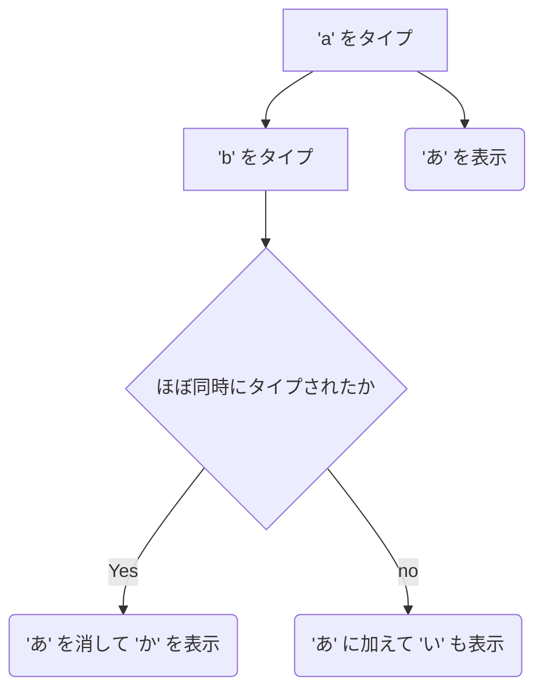

# この repo について

この repo は [Google IME](https://www.google.co.jp/ime/) (ならびにそのオープンソース版である [mozc](https://github.com/google/mozc)) で利用可能な配列を集めています。

こちらで公開されている配列は、別途用意した [Google Colab のページ](https://colab.research.google.com/drive/1yrMHatUh0UUdinRgZhoObCaV2i3JTXlc?usp=sharing) にてクリックだけで適用されるようになっています。

利用可能な配列は追々足していく予定です。もし足してほしい配列があれば、この repo の [Issues](https://github.com/kirameister/keyboard_layouts/issues) または [私の Twitter アカウント](https://twitter.com/kirameister_ja/) までご連絡ください (配列の追加を保証はできませんが、善処はします)。

# 現在公開している配列

このページでは、各ユーザーが独自に定義した配列を同時打鍵として利用できるようにする以外にも、既に世に広まっている配列を選択することができます。

## [新下駄配列](https://kouy.exblog.jp/13627994/)
統計情報 (100万語の日本語かな n-gram データ) を参考にしながら考えられた同時打鍵配列。このページでは、使っているキーボードの物理配列 (JIS  または ANSI US) に合わせて異なる配列を用意しているが、これはオリジナルの新下駄配列が JIS 物理配列を前提にデザインされたものであるため (ANSI US 版は Akira K. が勝手に作って公開している)。

## 新下駄配列 3 キー同時打鍵
新下駄配列は最大 2 つのキーを同時に押すことで同時打鍵配列を実現しているが、その新下駄配列を拡張して、[ま行]、[ば行]、そして [ぱ行] を (数字のある最上段ではなく) 文字が刻印されたキーで入力できるように変更した配列。新下駄配列では拗音を [I] または [O] と左手の指で入力するが、[I][O] と左手の指の 3 キー同時押しでこれらの文字を入力できる。

### `[Ｏ]+[Ｉ]` と同時押し

| 子 | 薬 | 中 | 人 | 伸 |  | 伸 | 人 | 中 | 薬 | 小 |  |
|---|---|---|---|---|---|---|---|---|---|---|---|
|  |  |  |  |  |  |  |  |  |  |  | - |
| ぴゅ | みゅ| みょ | びゅ |  |  |  |  |  |  |  |  |
| ぴょ |     |      | びょ |  |  |  |  |  |  |  |  |
| ぴゃ |     | みゃ | びゃ |  |  |  |  |  |  |  |  |

## [下駄配列](http://web1.nazca.co.jp/kouy/geta.html)

新下駄配列の前身となる配列。出現頻度の高い文字は 1 打鍵、出現頻度の低い文字は左右の手で同時に 2 つのキーを押す (同時打鍵) ことによって入力する配列。

## [かわせみ配列](https://github.com/semialt/kawasemi)

覚えやすくて効率がいい、文字キー同時押し行段系かな配列。50 音の行を示すキーを左手で、段を示すキーを右手で同時押しすることによってかな文字を入力する。

## [月配列](https://jisx6004.client.jp/tsuki.html)

2ちゃんねる発祥の配列。様々な派生型があるのだが、用意しているのは 2-263 というおそらく最もメジャーなバージョンの配列。同時打鍵配列ではないのだが、かな系の配列であり IME に閉じた形で実現するのには適している配列だと判断して選択可能な項目に加えた。

## [AZIK](http://hp.vector.co.jp/authors/VA002116/azik/azikinfo.htm)

ローマ字入力を拡張する形で登場した配列。同時打鍵配列ではなく、かな系の配列ですらないのだが、物理キーボード配列が QWERTY であることを前提に作られた配列であり、従って IME により実現することに意味はあると判断した。

# 公開しなかった配列

以下のような配列は IME に閉じた形で実現されるべきではないと考えて、敢えて公開はしていません。

* ローマ字の入力概念はそのままに、物理的なキーの位置を置き換える配列 ([大西配列](https://0414.works/hairetu/) や [Eucalyn 配列](https://eucalyn.hatenadiary.jp/entry/about-eucalyn-layout)など)。
    * このような配列は、ハードウェア/ファームウェアまたは ([Karabiner-Elements](https://karabiner-elements.pqrs.org/) のような) key-code を置き換えるようなソリューションの方が (日本語の IME に閉じた形で実装されるよりも) 望ましいと判断した。
* かな系の配列だが、同時打鍵の為のキーを親指を使って押すという設計になっている配列 ([薙刀式](http://oookaworks.seesaa.net/article/484704326.html) や [親指シフト](https://ja.wikipedia.org/wiki/%E8%A6%AA%E6%8C%87%E3%82%B7%E3%83%95%E3%83%88) など)。
    * 現状 Google IME / mozc に閉じた形で同時打鍵配列を実現するには、`Z` や `X` のように文字が刻印された文字を入力するためのキーを使う必要がある。所謂 Mod-key と呼ばれるような (Alt や Shift キーなど) キーをひらがな文字の入力に使用することができないため、Google IME / mozc に閉じた形で親指シフトなどの配列を実装することはできない。
* 現状の IME を使った実装方法では実現が難しい配列 ([かわせみ配列改](https://github.com/semialt/kawasemi#%E3%81%8B%E3%82%8F%E3%81%9B%E3%81%BF%E9%85%8D%E5%88%97%E6%94%B9)など)

これはある意味同時打鍵配列を IME にて実現することに起因する問題です。IME では既に入力されているかな文字を「上書き」(という表現が適切はわかりませんが) することができるため、以下のような振る舞いが可能です (以下の例では 'a->b' のほぼ同時ですが、'b->a' のほぼ同時押しでも 'か' が出力されます)。

このような実装スキームで、以下のような入出力が期待されている配列を考えてみましょう:
* `a` → 「あ」
* `b` → 「い」
* `c` → 「う」
* `a+b` OR `b+a` → 「あ」
* `a+b+c` OR `a+c+b` OR `b+a+c` OR `b+c+a` OR `c+a+b` OR `c+b+a` → 「あい」
ここでナイーブにテーブルを書いてしまうと、以下のようになります:

| 入力 | 出力 | 送り |
|---|---|---|
| a |  | あ |
| b |  | い |
| c |  | う |
| あb |  | あ |
| いa |  | あ |
| あc | あい |  |
| あうb | あい |  |
| あc | あい |  |
| いうa | あい |  |
| うあb | あい |  |
| ういa | あい |  |

上のテーブルを念頭に `a+c` と `c+a` の同時打鍵を考えてみましょう。`a+c` の場合はテーブル 1 行目と 6 行目のエントリーが効いてくるので「あい」が出力になります。しかし `うa => あい` というようなエントリーはないため、`c+a` の出力は「うあ」となってしまいます。ここで (更にナイーブに) `うa => あい` というテーブルのエントリーを加えれしまうと、本来期待されている `a+c => うあ` という入力がなくなってしまうことになります。それが期待されている振る舞いであれば良いのですが、その確証が取れない限り掲載すべきではないと判断しました。

